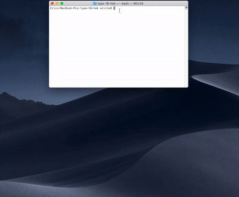

# **Type-18-hek**

## **Install**
### install dependencies
```bash
npm install
# OR
yarn
```

## **Start Server**

#### start project in development mode

```bash
npm start
# OR
yarn start
```
#### start project in production mode

```bash
npm run express
npm run koa
npm run hapi
```
OR

```bash
yarn run express
yarn run koa
yarn run hapi
```

## **Build Project**
```bash
npm run build
# OR
yarn run build
```

## **Browser Automation**

```bash
npm run browser-automation -chrome
# OR
yarn run browser-automation -chrome
```

- does not support the other browsers on the [list](https://www.selenium.dev/selenium/docs/api/javascript/module/selenium-webdriver/lib/capabilities_exports_Browser.html)

[](./browser-automation/yarn-ba.gif)

## **Test**

```bash
npm test
# OR
yarn test
```

- enzyme configuration:
  - create `.enzyme.setup.js`
  - in `package.json` include `"setupFilesAfterEnv": ["<rootDir>/.enzyme.setup.js"]`

## **Develop**
- The entry file is `./src/client/js/index.jsx`
- The router and redux store, actions, reducers are defined in `./src/client/js/settings/`
- The entry file in server is `./src/server/index.js`
