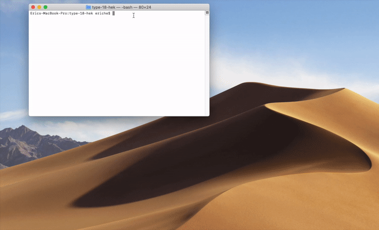

<h1>Type-18-hek</h1>

- [**Install**](#install)
  - [install dependencies](#install-dependencies)
- [**Start Server**](#start-server)
  - [start project in development mode](#start-project-in-development-mode)
  - [start project in production mode](#start-project-in-production-mode)
- [**Build Project**](#build-project)
- [**Browser Automation**](#browser-automation)
- [**Test**](#test)
- [**Lint**](#lint)
- [**Develop**](#develop)
  - [**Apollo + GraphQL Demo structure**](#apollo--graphql-demo-structure)


## **Install**
### install dependencies
```bash
npm install
# OR
yarn
```

## **Start Server**

### start project in development mode

```bash
npm start
# OR
yarn start
```
### start project in production mode

```bash
npm run express
npm run koa
npm run hapi
```
OR

```bash
yarn run express
yarn run koa
yarn run hapi
```

## **Build Project**
```bash
npm run build
# OR
yarn run build
```

## **Browser Automation**

```bash
npm run browser-automation -chrome
# OR
yarn run browser-automation -chrome
```

- does not support the other browsers on the [list](https://www.selenium.dev/selenium/docs/api/javascript/module/selenium-webdriver/lib/capabilities_exports_Browser.html)
- implemented with [`selenium-webdriver`](https://www.npmjs.com/package/selenium-webdriver) + [`chromedriver`](https://www.npmjs.com/package/chromedriver) (chrome >= 80)



## **Test**

```bash
npm test
# OR
yarn test
```

- enzyme configuration:
  - create `.enzyme.setup.js`
  - in `package.json` include `"setupFilesAfterEnv": ["<rootDir>/.enzyme.setup.js"]`

## **Lint**

use Eslint for code formatting

```bash
npm run lint
# OR
yarn run lint
```

## **Develop**
- The entry file is `./src/client/js/index.jsx`
- The router and redux store, actions, reducers are defined in `./src/client/js/settings/`
- The entry file in server is `./src/server/index.js`

### **Apollo + GraphQL Demo structure**

- dev
  - client: 
    - use `ApolloProvider` at `./src/client/js/index.jsx`
    - use `useQuery` and `useMutation` at `./src/client/js/components/Home/apollo-graphql-demo/LocalContext.jsx`
    - update local state and apollo cache after mutation
    - **leaflet css link tag was inserted into `./src/client/public/index.html` template**
    - in order to avoid render leaflet map on server side, use `loadable-components` for dynamic loading, and disable `ssr`
  - server: 
    - use `webpack-dev-server`
    - use config at `./configwebpackDevServer.config.js`, where apply `graphqlMiddleware2` middleware of `./src/server/express/graphql-middleware`
- prod
  - client: 
    - same as the above dev client
  - server: 
    - use `resolvers` and `typeDefs` in `./src/server/utils/graphql`
    - use `apollo-server-hapi/koa/express` for hapi/koa/express server respectively
    - the used apollo middleware/server will read data from `./src/data/landmarks.geo.json` with node.js `fs` to mock up the process of data fetching.